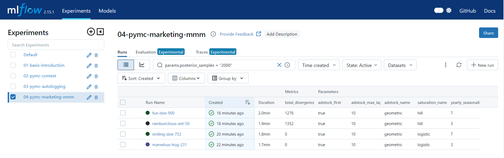

## PyMC-Marketing Marketing Mix Model MLflow Logging

The [`__main__.py`](__main__.py) script kicks off [various model
configurations](./run-config.yaml) and logs each as a separate run in MLflow.
The script leverages the `pymc_marketing.mlflow.autolog` function as well as
various `mlflow` log functions in order to customize the logging of the model.

Below are a subset of the metrics & parameters:

And the artifacts that are saved off: 

