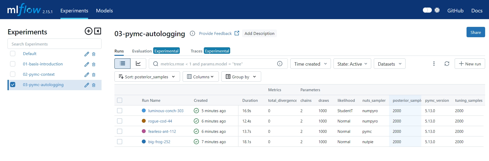

# PyMC with MLflow

This is a simple example of using PyMC with MLflow.

This focuses on logging parameters, metrics, and artifacts to MLflow.

## Scripts

There are three scripts: 

1. Non-PyMC example showing how to log parameters, metrics, and artifacts to MLflow.
2. PyMC example which logs some PyMC related metrics to MLflow
3. Logging with [`pymc_marketing.mlflow`](https://www.pymc-marketing.io/en/latest/api/generated/pymc_marketing.mlflow.html) module.

Kick them off with `make experiments`. View with `make serve`. Clean up with `make clean_up`.

## Resources

- [`pymc_marketing.mlflow` Module](https://www.pymc-marketing.io/en/latest/api/generated/pymc_marketing.mlflow.html)
