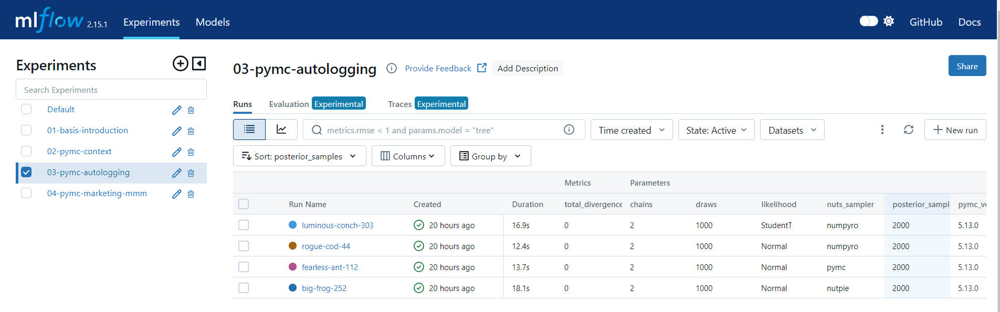

# PyMC with MLflow

This is a simple example of using PyMC with MLflow.

This focuses on logging parameters, metrics, and artifacts to MLflow.

## Scripts

There are four scripts: 

1. [Non-PyMC example showing how to log parameters, metrics, and artifacts to MLflow](./01-basic-introduction.py)
2. [PyMC example which logs some PyMC related metrics to MLflow](./02-pymc-context.py)
3. [Logging that and more with `pymc_marketing.mlflow` module](./03-pymc-autologging.py)
4. [Autologging of Marketing Mix Model with `pymc_marketing.mlflow` module](./04-pymc-marketing-mmm)

Kick them off with `make experiments`. View with `make serve`. Clean up with `make clean_up`.

## Resources

- [`pymc_marketing.mlflow` module](https://www.pymc-marketing.io/en/latest/api/generated/pymc_marketing.mlflow.html)
